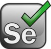

<h1 align="center">Hi there, I'm Kira :wave:</h1> 
<h3 align="center">QA Automation Engineer since 2019</h3>

<h3>Technologies I Have Experience With</h3>

| | | | | | |
| ------------- | ------------- | ------------- | ------------- |------------- |------------- |
| Java  |  | Selenium  |   | Allure Report  |   |
| Gradle  |  | Selenide  |   |  Docker  |   |
| TestNG  |  | Bitbucket  |  | Jenkins  |  |
| JUnit5  |  | Github  |  | Selenoid  |  |
| REST-Assured  |  | Jira  |   | Postman  |  |

Here are some ideas to get you started:

- 🔭 I’m currently working on ...
- 🌱 I’m currently learning ...
- 👯 I’m looking to collaborate on ...
- 🤔 I’m looking for help with ...
- 💬 Ask me about ...
- 📫 How to reach me: ...
- 😄 Pronouns: ...
- ⚡ Fun fact: ...
-->
