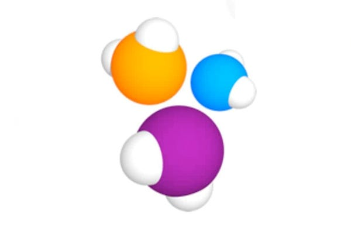
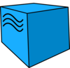

<h1 align="center">Hi there, I'm Kira :wave:</h1> 
<h3 align="center">QA Automation Engineer since 2019</h3>

<h2>Technologies I Have Experience With</h2>

  
  
  
  
  
  
  
  
  
  
  
  
  
  

Here are some ideas to get you started:

- 🔭 I’m currently working on ...
- 🌱 I’m currently learning ...
- 👯 I’m looking to collaborate on ...
- 🤔 I’m looking for help with ...
- 💬 Ask me about ...
- 📫 How to reach me: ...
- 😄 Pronouns: ...
- ⚡ Fun fact: ...
-->
